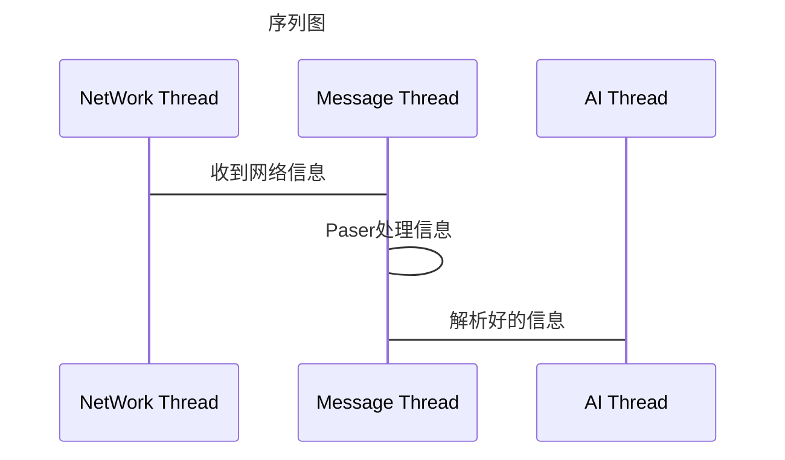
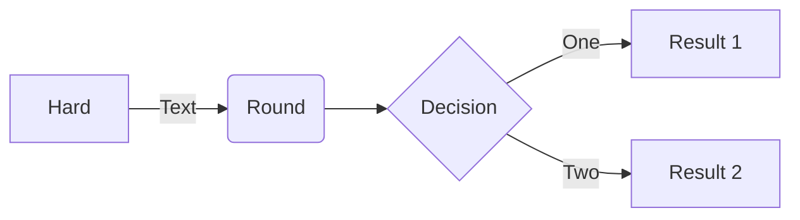
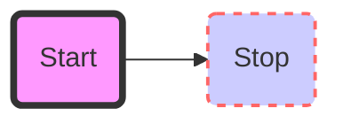
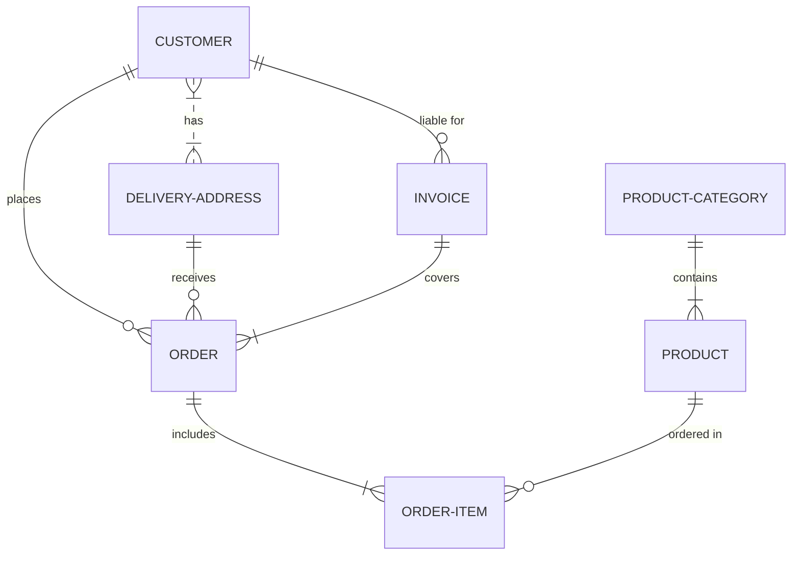

```mermaid
sequenceDiagram;
    title: 序列图
    participant NetWork Thread
    participant Message Thread
    participant AI Thread

    NetWork Thread->Message Thread: 收到网络信息
    Message Thread->Message Thread: Paser处理信息
    Message Thread->AI Thread: 解析好的信息
```

```mermaid
flowchart LR;
    A[Hard] -->|Text| B(Round)
    B --> C{Decision}
    C -->|One| D[Result 1]
    C -->|Two| E[Result 2]
```

```mermaid
graph LR
    id1(Start)-->id2(Stop)
    style id1 fill:#f9f,stroke:#333,stroke-width:4px
    style id2 fill:#ccf,stroke:#f66,stroke-width:2px,stroke-dasharray: 5, 5
```

```mermaid
graph TB
    id1(圆角矩形)--普通线-->id2[矩形]
    subgraph 子图表
        id2==粗线==>id3{菱形}
        id3-.虚线.->id4>右向旗帜]
        id3--无箭头---id5((圆形))
    end
    style id1 fill:#f9f,stroke:#333,stroke-width:4px
```

```mermaid
erDiagram
          CUSTOMER }|..|{ DELIVERY-ADDRESS : has
          CUSTOMER ||--o{ ORDER : places
          CUSTOMER ||--o{ INVOICE : "liable for"
          DELIVERY-ADDRESS ||--o{ ORDER : receives
          INVOICE ||--|{ ORDER : covers
          ORDER ||--|{ ORDER-ITEM : includes
          PRODUCT-CATEGORY ||--|{ PRODUCT : contains
          PRODUCT ||--o{ ORDER-ITEM : "ordered in"
```